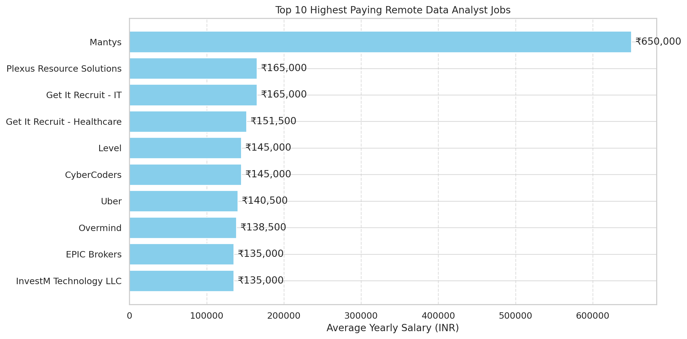
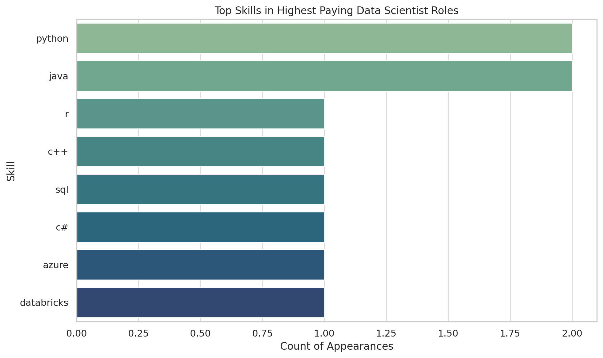

# Introduction
📊Dive into the data job market! Focusing on the data Analyst roles, this project explores 💰 top- paying job, 🔥in-demand skills, and 📈where high demand meets high salary in data analytics.

🔍 SQL queries?? Check them out here :[project_sql_folder](/project_sql/)

# Background
Driven by a quest to navigate the data analyst job market more effectively, this project was born from a desire to pin-point top-paid and in-demand skills, streamlining others work to find optimal jobs.

# Tools I used
🔧 Tools Used
**SQLite**: Used as a lightweight database to store and query job and skill datasets efficiently for quick analysis.

**PostgreSQL**: Utilized for advanced SQL operations like joins, grouping, and filtering large datasets to uncover insights.

**VS Code**: My primary code editor for writing and debugging SQL queries, with extensions for database and Git support.

**GitHub**: Used to version control and share my data analysis project, including SQL scripts, visualizations, and documentation.

# the Analysis
Each query for this project aimed at investigating specifies of the data analyst job market. Here's how i approached each question:

### 1. Top Paying Data Analyst JObs
Highlights the high paying oppurtunities in the field.
``` SQL
SELECT
    job_id,
    job_title,
    job_location,
    salary_year_avg,
    job_schedule_type,
    job_posted_date,
    name as company_name
FROM
    job_postings_fact
LEFT JOIN company_dim
    ON job_postings_fact.company_id = company_dim.company_id
WHERE
    job_title='Data Analyst' AND job_location='Anywhere' 
    AND salary_year_avg IS NOT NULL
ORDER BY
    salary_year_avg DESC
LIMIT 10;
```



### 2. Top Paying Job Skills
``` SQL
SELECT
    job_postings_fact.job_id,
    job_title,
    job_location,
    salary_year_avg,
    name as company_name,
    skills as job_skills
FROM
    job_postings_fact
LEFT JOIN company_dim
    ON job_postings_fact.company_id = company_dim.company_id
LEFT JOIN skills_job_dim
    ON job_postings_fact.job_id = skills_job_dim.job_id
LEFT JOIN skills_DIM
    ON skills_job_dim.skill_id = skills_dim.skill_id 
WHERE
     salary_year_avg IS NOT NULL
ORDER BY
    salary_year_avg DESC
LIMIT 10;
```


#### This is the bar-graph representation of the above quires.

# what i have Learned
📊 What I Learned from the Data Analysis Project
SQL for Data Extraction: Gained hands-on experience with SQL querying to join multiple tables, filter data, group results, and sort key insights like top-paying jobs and most in-demand skills.

Data Cleaning & Exploration: Learned how to handle missing values, resolve column ambiguities, and prepare structured data for analysis.

Skill Demand Analysis: Identified top skills in demand for roles like Data Analyst and Data Scientist using groupings and counts.

Company & Role Insights: Analyzed job trends, salaries, and locations to find which companies offer the highest pay for remote roles.

Data Visualization (Python + Matplotlib): Created clear, professional charts to visually present trends and insights from job datasets.

Version Control with Git & GitHub: Used Git to track project progress and GitHub to showcase my project and learning journey.

Tools Used: PostgreSQL / SQLite for querying, VS Code for development, GitHub for version control and sharing, and Python for plotting.


### ✅ Conclusion
This project provided a comprehensive, hands-on experience in real-world data analysis. By working with a structured job postings dataset, I applied essential SQL techniques to extract meaningful insights about roles, salaries, company trends, and in-demand skills. Visualizations helped translate raw data into digestible insights, supporting data-driven decision-making.

Through this analysis, I enhanced my ability to:

Clean and manipulate large datasets

Write efficient SQL queries with joins, filters, and aggregations

Identify key business insights from hiring trends

Visualize data effectively using Python (Matplotlib/Seaborn)

Present findings in a clear and structured manner

This project reflects my strong foundation in data analytics and demonstrates my readiness to apply these skills to solve real business problems.